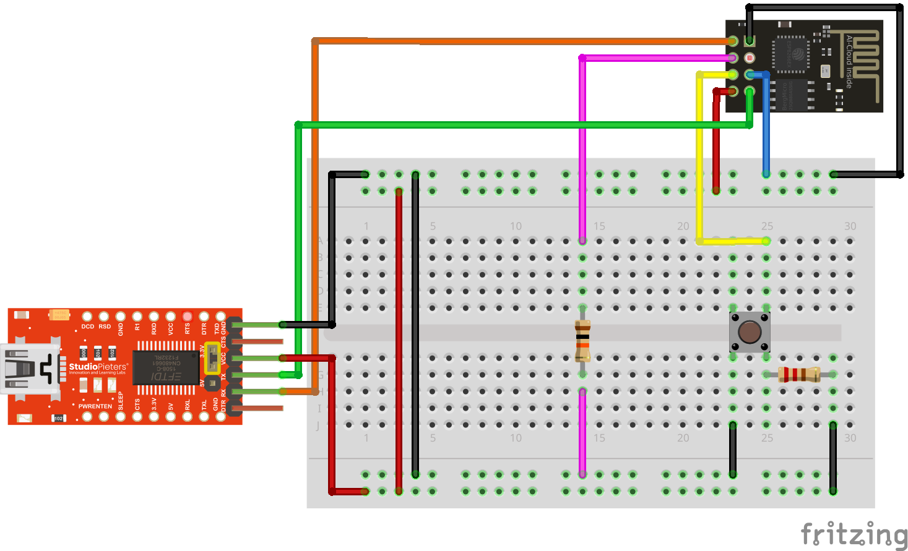

# ESP-01 Move MQTT

https://docs.platformio.org/en/stable/boards/espressif8266/esp01.html

## ESP-01

## FT232

## MPU-6050

## WiFi

https://github.com/arduino-libraries/WiFi

## ArduinoJson

https://arduinojson.org/

## ESP-01 Wiring

```
3.3V -> VC
GND -> GND
RX -> TX
TX -> RX
```

## ESP-01 Flashing

https://edistechlab.com/esp8266-01-einfach-erklaert/?v=3a52f3c22ed6

Default setup for connecting a FT232 to an ESP-01:

```
3.3V -> VC
GND -> GND
RX -> TX
TX -> RX
```

Easiest setup for flashing an ESP-01:

```
VCC -> 10k resistor -> CHPD
GND -> GPO (Flashmode)
GND -> RST (Reset)
```



## ESP-01 Regular Serial Output

`monitor_speed = 115800`

```
Initializing sensors
```

## ESP-01 Boot Serial Output

`monitor_speed = 74880`

```
load 0x4010f000, len 3424, room 16 
tail 0
chksum 0x2e
load 0x3fff20b8, len 40, room 8 
tail 0
chksum 0x2b
csum 0x2b
v000490b0
~ld
rf cal sector: 124
freq trace enable 0
rf[112] : 0
```

## Related Projects

https://www.itsalllost.com/mpu6050-esp8266-01-mqtt/

https://wolles-elektronikkiste.de/mpu6050-beschleunigungssensor-und-gyroskop